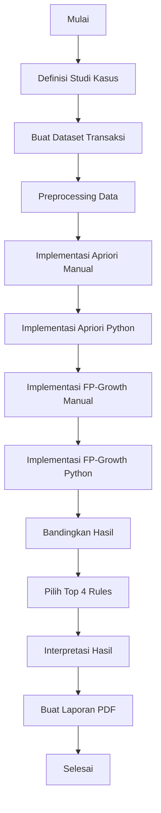

# Rencana Pengerjaan Tugas 4 - Data Mining: Association Rules

## 📋 Ringkasan Tugas
Menganalisis pola pembelian menggunakan algoritma Association Rules (Apriori dan FP-Growth) pada studi kasus pemesanan makanan di restoran/cafe dengan data dari 10 responden.

---

## 🎯 Studi Kasus: Analisis Pola Pemesanan di Cafe "Kopi Senja"

### Deskripsi Studi Kasus
Cafe "Kopi Senja" adalah kedai kopi lokal yang menyajikan berbagai menu minuman dan makanan. Manajemen cafe ingin memahami pola pemesanan pelanggan untuk:
- Meningkatkan strategi cross-selling (menawarkan produk yang sering dibeli bersama)
- Mengoptimalkan penempatan menu pada display
- Membuat paket promosi yang menarik
- Mengelola stok bahan baku lebih efisien

### Responden (10 Orang)
1. Dinunaya Syuja 'Aryoko
2. Ahmad Arya Dwi Febriansyah
3. Vito Agatha Satritama
4. Moh. Dani Wahyudi
5. Achmad Wildan Muzaky
6. Frenky
7. Andries Nauvalentin Roestam
8. Muhammad Alvin Firdaus
9. Husni Mubarok
10. Abiyyu Valin Zavero

### Menu Cafe (Item Set)
Berikut adalah menu yang tersedia di Cafe "Kopi Senja":

**Minuman:**
- Kopi Hitam
- Kopi Susu
- Cappuccino
- Latte
- Teh Manis
- Jus Jeruk
- Air Mineral

**Makanan:**
- Roti Bakar
- Croissant
- Donut
- Kue Coklat
- Pisang Goreng
- Nasi Goreng
- Mie Goreng

**Snack:**
- Keripik Kentang
- Biskuit

---

## 📊 Struktur Dataset Transaksi

### Format Dataset
Dataset akan disusun dalam format transaksi, di mana setiap baris merepresentasikan satu transaksi pembelian oleh seorang responden.

### Contoh Struktur Data
```python
# Format: {Responden: [Item1, Item2, Item3, ...]}
transactions = {
    'Dinunaya Syuja Aryoko': ['Kopi Susu', 'Roti Bakar', 'Keripik Kentang'],
    'Ahmad Arya Dwi Febriansyah': ['Cappuccino', 'Croissant', 'Air Mineral'],
    # ... dan seterusnya untuk 10 responden
}
```

### Kriteria Pembuatan Dataset
- Setiap responden memiliki 2-5 item per transaksi
- Item dipilih secara logis (misal: minuman + makanan)
- Konsisten dengan pola pembelian cafe yang realistis
- Memastikan variasi untuk mendapatkan association rules yang menarik

---

## 🔬 Metodologi: Algoritma Association Rules

### 1. Algoritma Apriori

#### Langkah-langkah Apriori:

**Step 1: Menentukan Minimum Support**
- Hitung total transaksi (n = 10)
- Tentukan minimum support threshold (misal: 30% atau 0.3)
- Minimum support count = 10 × 0.3 = 3 transaksi

**Step 2: Membuat Frequent 1-Itemset (C1 → L1)**
- Hitung frekuensi kemunculan setiap item
- Filter item yang memenuhi minimum support
- Hasil: L1 (frequent 1-itemset)

**Step 3: Membuat Frequent 2-Itemset (C2 → L2)**
- Buat kombinasi pasangan item dari L1
- Hitung support untuk setiap pasangan
- Filter pasangan yang memenuhi minimum support
- Hasil: L2 (frequent 2-itemset)

**Step 4: Membuat Frequent 3-Itemset (C3 → L3)**
- Buat kombinasi triplet item dari L2
- Hitung support untuk setiap triplet
- Filter triplet yang memenuhi minimum support
- Hasil: L3 (frequent 3-itemset)

**Step 5: Generate Association Rules**
- Dari frequent itemset, buat aturan asosiasi
- Hitung confidence untuk setiap aturan
- Filter aturan yang memenuhi minimum confidence (misal: 70%)
- Hitung lift untuk menilai kekuatan asosiasi

### 2. Algoritma FP-Growth

#### Langkah-langkah FP-Growth:

**Step 1: Scan Database & Buat Frequent 1-Itemset**
- Hitung frekuensi setiap item
- Urutkan item berdasarkan frekuensi (descending)
- Filter item yang memenuhi minimum support

**Step 2: Sort & Reorder Transactions**
- Urutkan item dalam setiap transaksi berdasarkan frekuensi
- Buat ordered itemset untuk setiap transaksi

**Step 3: Bangun FP-Tree**
- Buat root node (null)
- Insert setiap transaksi yang sudah diurutkan ke FP-Tree
- Increment count untuk node yang sudah ada
- Buat node baru untuk item yang belum ada

**Step 4: Mining Frequent Patterns**
- Untuk setiap item dalam frequent 1-itemset (dari bawah ke atas):
  - Cari conditional pattern base
  - Bangun conditional FP-Tree
  - Generate frequent patterns dari conditional FP-Tree

**Step 5: Generate Association Rules**
- Dari frequent patterns yang ditemukan
- Hitung confidence dan lift
- Pilih rules yang relevan

---

## 📐 Perhitungan Association Rules

### Rumus-rumus Penting:

1. **Support**
   ```
   Support(A → B) = (Jumlah transaksi mengandung A dan B) / (Total transaksi)
   ```

2. **Confidence**
   ```
   Confidence(A → B) = (Jumlah transaksi mengandung A dan B) / (Jumlah transaksi mengandung A)
   ```

3. **Lift**
   ```
   Lift(A → B) = Confidence(A → B) / Support(B)
   ```

### Interpretasi Lift:
- **Lift > 1**: Item A dan B muncul bersama lebih sering dari yang diharapkan (positive correlation)
- **Lift = 1**: Item A dan B independen (no correlation)
- **Lift < 1**: Item A dan B muncul bersama lebih jarang dari yang diharapkan (negative correlation)

### Target: Minimal 4 Association Rules
Contoh rules yang akan dianalisis:
1. Rule 1: {Kopi Susu} → {Roti Bakar}
2. Rule 2: {Cappuccino} → {Croissant}
3. Rule 3: {Teh Manis} → {Donut}
4. Rule 4: {Kopi Hitam, Roti Bakar} → {Keripik Kentang}

Setiap rule akan dilengkapi dengan nilai:
- Support (dalam persentase dan desimal)
- Confidence (dalam persentase dan desimal)
- Lift (nilai desimal)
- Interpretasi deskriptif

---

## 📓 Struktur Jupyter Notebook (tugas4.ipynb)

### Cell 1: Import Libraries
```python
import pandas as pd
import numpy as np
from mlxtend.frequent_patterns import apriori, association_rules
from mlxtend.preprocessing import TransactionEncoder
import matplotlib.pyplot as plt
import seaborn as sns
```

### Cell 2: Define Dataset
```python
# Dataset transaksi 10 responden
transactions = [
    # List of transactions
]
```

### Cell 3: Data Preprocessing
```python
# Convert transactions to DataFrame
# Create binary encoded matrix
```

### Cell 4: Exploratory Data Analysis
```python
# Visualisasi frekuensi item
# Statistik dasar dataset
```

### Cell 5: Apriori Algorithm - Manual Calculation
```python
# Step-by-step manual calculation
# C1, L1, C2, L2, C3, L3
# Tampilkan tabel hasil
```

### Cell 6: Apriori Algorithm - Python Implementation
```python
# Menggunakan mlxtend library
# Generate frequent itemsets
# Generate association rules
```

### Cell 7: FP-Growth Algorithm - Manual Calculation
```python
# Step-by-step manual calculation
# Build FP-Tree
# Mining frequent patterns
```

### Cell 8: FP-Growth Algorithm - Python Implementation
```python
# Menggunakan mlxtend library
# Generate frequent itemsets
# Generate association rules
```

### Cell 9: Compare Results
```python
# Bandingkan hasil Apriori dan FP-Growth
# Analisis perbedaan dan kesamaan
```

### Cell 10: Select Top 4 Rules
```python
# Pilih 4 rules terbaik berdasarkan lift dan confidence
# Tampilkan dalam format tabel
```

### Cell 11: Interpretation
```python
# Interpretasi deskriptif untuk setiap rule
# Rekomendasi bisnis
```

### Cell 12: Conclusion
```python
# Ringkasan hasil
# Implikasi bisnis
```

---

## 📄 Struktur Laporan PDF

### 1. Halaman Judul
- Judul Tugas
- Nama Mata Kuliah
- Nama Dosen Pengampu
- Nama Mahasiswa
- NIM
- Tanggal

### 2. Abstrak
- Ringkasan singkat tugas
- Metodologi yang digunakan
- Hasil utama

### 3. Daftar Isi

### 4. Pendahuluan
#### 4.1 Latar Belakang
- Pentingnya analisis association rules dalam bisnis
- Penerapan di industri retail/F&B

#### 4.2 Rumusan Masalah
- Bagaimana menemukan pola pembelian pelanggan?
- Item apa yang sering dibeli bersama?

#### 4.3 Tujuan
- Menerapkan algoritma Apriori dan FP-Growth
- Menemukan association rules yang berguna
- Memberikan rekomendasi bisnis

### 5. Tinjauan Pustaka
#### 5.1 Association Rules
- Definisi dan konsep dasar
- Support, Confidence, Lift

#### 5.2 Algoritma Apriori
- Konsep dan langkah-langkah
- Kelebihan dan kekurangan

#### 5.3 Algoritma FP-Growth
- Konsep dan langkah-langkah
- Kelebihan dan kekurangan

#### 5.4 Perbandingan Apriori vs FP-Growth
- Efisiensi komputasi
- Penggunaan memori

### 6. Metodologi
#### 6.1 Studi Kasus
- Deskripsi Cafe "Kopi Senja"
- Responden dan profil mereka

#### 6.2 Dataset
- Struktur data
- Item yang tersedia
- Cara pembuatan dataset

#### 6.3 Preprocessing
- Transformasi data
- Encoding

#### 6.4 Algoritma
- Detail implementasi Apriori
- Detail implementasi FP-Growth

### 7. Hasil dan Pembahasan
#### 7.1 Exploratory Data Analysis
- Statistik deskriptif
- Visualisasi data

#### 7.2 Implementasi Apriori
- Frequent itemsets (L1, L2, L3)
- Association rules yang ditemukan
- Tabel hasil perhitungan manual dan Python

#### 7.3 Implementasi FP-Growth
- FP-Tree yang dibangun
- Frequent patterns yang ditemukan
- Association rules yang ditemukan
- Tabel hasil perhitungan manual dan Python

#### 7.4 Perbandingan Hasil
- Tabel perbandingan Apriori vs FP-Growth
- Analisis kesamaan dan perbedaan

#### 7.5 Top 4 Association Rules
- Tabel lengkap dengan Support, Confidence, Lift
- Interpretasi untuk setiap rule

### 8. Interpretasi dan Rekomendasi
#### 8.1 Interpretasi Hasil
- Makna dari association rules yang ditemukan
- Pola pembelian pelanggan

#### 8.2 Rekomendasi Bisnis
- Strategi cross-selling
- Penempatan menu
- Paket promosi
- Manajemen stok

### 9. Kesimpulan
- Ringkasan hasil analisis
- Implikasi untuk bisnis
- Keterbatasan studi

### 10. Saran
- Pengembangan lebih lanjut
- Penerapan algoritma lain

### 11. Referensi
- Daftar pustaka yang digunakan

### 12. Lampiran
- Kode lengkap Python
- Output program
- Data mentah

---

## 🔄 Alur Kerja Pengerjaan



---

## 📝 Checklist Pengerjaan

### Phase 1: Persiapan
- [ ] Tentukan menu cafe (minuman, makanan, snack)
- [ ] Buat dataset transaksi untuk 10 responden
- [ ] Pastikan dataset logis dan konsisten

### Phase 2: Implementasi Apriori
- [ ] Hitung frequent 1-itemset (L1) secara manual
- [ ] Hitung frequent 2-itemset (L2) secara manual
- [ ] Hitung frequent 3-itemset (L3) secara manual
- [ ] Generate association rules dari frequent itemsets
- [ ] Implementasi Apriori menggunakan Python (mlxtend)
- [ ] Bandingkan hasil manual dan Python

### Phase 3: Implementasi FP-Growth
- [ ] Hitung frequent 1-itemset dan urutkan
- [ ] Reorder transaksi berdasarkan frekuensi
- [ ] Bangun FP-Tree secara manual
- [ ] Mine frequent patterns dari FP-Tree
- [ ] Generate association rules
- [ ] Implementasi FP-Growth menggunakan Python (mlxtend)
- [ ] Bandingkan hasil manual dan Python

### Phase 4: Analisis Hasil
- [ ] Pilih minimal 4 association rules terbaik
- [ ] Hitung support, confidence, dan lift untuk setiap rule
- [ ] Interpretasi hasil secara deskriptif
- [ ] Buat rekomendasi bisnis

### Phase 5: Dokumentasi
- [ ] Selesaikan Jupyter Notebook (tugas4.ipynb)
- [ ] Buat laporan PDF lengkap
- [ ] Review dan perbaiki jika diperlukan

---

## ⚙️ Parameter yang Akan Digunakan

### Minimum Support
- Nilai: 30% (0.3)
- Minimum support count: 3 transaksi (dari 10 transaksi)
- Alasan: Cukup ketat untuk mendapatkan rules yang meaningful, namun tidak terlalu strict

### Minimum Confidence
- Nilai: 70% (0.7)
- Alasan: Memastikan rules yang dihasilkan memiliki kepercayaan tinggi

### Metric Utama untuk Pemilihan Rules
1. **Lift** (prioritas utama) - Rules dengan lift > 1 menunjukkan positive correlation
2. **Confidence** - Rules dengan confidence tinggi lebih reliable
3. **Support** - Rules dengan support yang cukup tinggi lebih relevan secara statistik

---

## 🎯 Output yang Diharapkan

### 1. Jupyter Notebook (tugas4.ipynb)
- Kode yang lengkap dan terstruktur
- Penjelasan setiap langkah dalam markdown cells
- Output yang jelas dan mudah dipahami
- Visualisasi data dan hasil

### 2. Laporan PDF
- Format profesional dan rapi
- Bahasa Indonesia yang baik dan benar
- Penjelasan yang detail namun ringkas
- Tabel dan grafik yang informatif
- Interpretasi yang mendalam

---

## 💡 Catatan Penting

1. **Konsistensi Data**: Pastikan dataset dibuat dengan logika yang konsisten (misal: seseorang tidak memesan 5 minuman tanpa makanan)

2. **Dokumentasi Manual**: Setiap perhitungan manual harus didokumentasikan dengan jelas untuk memudahkan pemahaman

3. **Validasi Hasil**: Bandingkan hasil perhitungan manual dengan hasil Python untuk memastikan akurasi

4. **Interpretasi Mendalam**: Jangan hanya menampilkan angka, tapi jelaskan makna dan implikasinya

5. **Rekomendasi Praktis**: Berikan rekomendasi yang bisa diterapkan langsung di bisnis cafe

---

## 📚 Referensi yang Akan Digunakan

1. Han, J., Pei, J., & Kamber, M. (2011). Data Mining: Concepts and Techniques. Morgan Kaufmann.

2. Agrawal, R., & Srikant, R. (1994). Fast Algorithms for Mining Association Rules.

3. Han, J., Pei, J., & Yin, Y. (2000). Mining Frequent Patterns without Candidate Generation.

4. Dokumentasi mlxtend: https://rasbt.github.io/mlxtend/

---

## ✅ Kriteria Keberhasilan

- [ ] Dataset dibuat dengan logika yang benar
- [ ] Algoritma Apriori diimplementasikan dengan benar (manual dan Python)
- [ ] Algoritma FP-Growth diimplementasikan dengan benar (manual dan Python)
- [ ] Minimal 4 association rules ditemukan dan dihitung dengan benar
- [ ] Nilai support, confidence, dan lift dihitung dengan akurat
- [ ] Interpretasi hasil dilakukan secara deskriptif dan mendalam
- [ ] Jupyter Notebook lengkap dan terstruktur dengan baik
- [ ] Laporan PDF komprehensif dan profesional
- [ ] Rekomendasi bisnis yang relevan dan praktis

---

## 📅 Timeline Pengerjaan (Estimasi)

1. **Persiapan & Pembuatan Dataset**: 1 hari
2. **Implementasi Apriori**: 1-2 hari
3. **Implementasi FP-Growth**: 1-2 hari
4. **Analisis & Interpretasi**: 1 hari
5. **Penulisan Laporan**: 1-2 hari
6. **Review & Perbaikan**: 1 hari

Total estimasi: 6-9 hari

---

*Catatan: Rencana ini bersifat fleksibel dan dapat disesuaikan sesuai kebutuhan dan feedback selama proses pengerjaan.*
